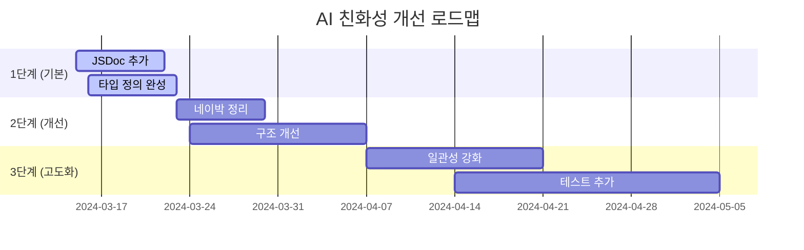

# AI 친화성 점수 측정 시스템

> 컴포넌트의 AI 친화성을 객관적으로 측정하기 위한 포괄적 지표 체계
> 작성일: 2026-03-14

---

## 🎯 측정 목표

### 1. **정량적 평가**
- 컴포넌트별 AI 이해도 점수화
- 개선 전후 비교를 통한 성장 측정
- 팀 표준화 및 일관성 확보

### 2. **질적 개선**
- AI가 이해하기 어려운 부분 식별
- 코드 리팩토링 우선순위 결정
- 문서화 부분 보완

### 3. **지속적 개선**
- CI/CD 통합으로 자동 측정
- 정기적인 점수 모니터링
- 성장 추적 및 보고

---

## 📊 종합 점수 체계

### 점수 등급 분류
| 등급 | 점수 범위 | 설명 |
|------|-----------|------|
| 🟢 **훌륭** | 90-100 | AI가 완벽하게 이해하고 사용하기 쉬움 |
| 🟡 **우수** | 80-89 | 대부분 부분에서 AI 친화적임 |
| 🟠 **양호** | 60-79 | 기본은 되지만 개선점 있음 |
| 🔴 **개선필요** | 0-59 | AI 이해도 현저히 낮음 |

### 종합 점수 공식
```
최종 점수 = (명명 점수 × 0.25) + (타입 점수 × 0.25) + (문서 점수 × 0.2) + (구조 점수 × 0.2) + (일관성 점수 × 0.1)
```

---

## 📋 상세 측정 지표

### 1. **명명 지표 (25%)**

#### 1.1 컴포넌트 명명 (10점)
```typescript
// ✅ 예시 (점수: 10/10)
HiButton, HiInput, HiCard
useTheme, useToggle, useMediaQuery

// ✅ 예시 (점수: 8/10)
Button, Input, Card  // Hi 접두사 없음
useTheme  // 좋으나 use를 제외하면 의미 파악 어려움

// ❌ 예시 (점수: 2/10)
MagicButton, SuperInput, CoolCard
doSomething, handleThing, processData
```

**평가 기준**:
- 10점: Hi 접두사 포함, 명확한 의미
- 8점: 의미는 명확하나 접두사 없음
- 5점: 일반적이지만 의미 파악 가능
- 2점: 의미 불명확하거나 너무 추상적

#### 1.2 변수/함수 명명 (10점)
```typescript
// ✅ 예시 (점수: 10/10)
const themeContext = createContext();
const [isDarkMode, setIsDarkMode] = useState(false);
const buttonStyles = getButtonStyles({ variant, size });

// ✅ 예시 (점수: 7/10)
const theme = createContext();
const [darkMode, setDarkMode] = useState(false);
const styles = getStyles({ variant, size });

// ❌ 예시 (점수: 3/10)
const ctx = createContext();
const dm = useState(false);
const stl = getStl(v, s);
```

**평가 기준**:
- 10점: 완전히 설명적
- 7점: 일반적이지만 이해 가능
- 3점: 축약되거나 의미 불명확
- 0점: 의미 전혀 파악 불가

#### 1.3 Props 명명 (5점)
```typescript
// ✅ 예시 (점수: 5/5)
{ variant, size, disabled, children, onPress }

// ✅ 예시 (점수: 3/5)
{ type, width, active, content, onClick }

// ❌ 예시 (점수: 1/5)
{ x, y, z, a, b, c }
```

**평가 기준**:
- 5점: 모든 props 의미 명확
- 3점: 대부분 의미 명확
- 1점: 의미 파악 거의 불가능

### 2. **타입 지표 (25%)**

#### 2.1 타입 정의 완도 (10점)
```typescript
// ✅ 예시 (점수: 10/10)
interface ButtonProps {
  variant: 'primary' | 'secondary' | 'ghost' | 'outline';
  size: 'sm' | 'md' | 'lg';
  disabled?: boolean;
  children: React.ReactNode;
  onPress?: () => void;
}

// ❌ 예시 (점수: 3/10)
interface ButtonProps {
  v: string; // variant의 약자
  s: string; // size의 약자
  d?: boolean; // disabled의 약자
  c: any; // children의 약자
}

// ❌ 예시 (점수: 0/10)
// 타입 정의 전혀 없음 (any 사용만)
```

**평가 기준**:
- 10점: 모든 props에 명시적 타입
- 7점: 대부분 타입 정의 있음
- 3점: 타입 정의 부족
- 0점: 타입 정의 없음

#### 2.2 타입 구체성 (10점)
```typescript
// ✅ 예시 (점수: 10/10)
type Size = 'sm' | 'md' | 'lg';
type Variant = 'primary' | 'secondary' | 'ghost' | 'outline';

// ✅ 예시 (점수: 7/10)
interface ButtonProps {
  variant: string; // 특정 값 제한 없음
  size: number; // 숫자만 허용
}

// ❌ 예시 (점수: 2/10)
interface ButtonProps {
  variant: any; // 모든 허용
  size: unknown; // 타입 불명확
}
```

**평가 기준**:
- 10점: 유니온 타입 등 구체적 타입
- 7점: 기본 타지만 값 제한 있음
- 2점: any/unknown 남발
- 0점: 타입 시스템 전혀 사용 안 함

#### 2.3 제네릭 활용 (5점)
```typescript
// ✅ 예시 (점수: 5/5)
interface ListProps<T> {
  items: T[];
  renderItem: (item: T) => React.ReactNode;
}

// ✅ 예시 (점수: 3/5)
interface ListProps {
  items: any[];
  renderItem: (item: any) => React.ReactNode;
}

// ❌ 예시 (점수: 0/5)
// 제네릭 전혀 사용하지 않음
```

### 3. **문서 지표 (20%)**

#### 3.1 JSDoc 완도 (10점)
```typescript
// ✅ 예시 (점수: 10/10)
/**
 * 테마를 관리하는 커스텀 훅
 * @returns {object} 테마 관련 상태와 함수
 * @property {string} currentTheme - 현재 테마
 * @property {function} toggleTheme - 테마 전환 함수
 * @example
 * const { currentTheme, toggleTheme } = useTheme();
 */
const useTheme = () => { ... }

// ✅ 예시 (점수: 5/10)
// @brief 테마 훅
// @returns 테마 객체
const useTheme = () => { ... }

// ❌ 예시 (점수: 0/10)
// JSDoc 전혀 없음
```

#### 3.2 예시 코드 포함 (5점)
```typescript
// ✅ 예시 (점수: 5/5)
/**
 * @example
 * <HiButton variant="primary" size="md">
 *   Click me
 * </HiButton>
 */

// ❌ 예시 (점수: 0/5)
// 예시 코드 없음
```

#### 3.3 에러 문서화 (5점)
```typescript
// ✅ 예시 (점수: 5/5)
/**
 * @throws {ThemeError} 테마 컨텍스트 없을 때 발생
 */
const useTheme = () => { ... }

// ❌ 예시 (점수: 0/5)
// 예외 처리 문서 없음
```

### 4. **구조 지표 (20%)**

#### 4.1 단일 책임 원칙 (5점)
```typescript
// ✅ 예시 (점수: 5/5)
// Button.tsx - 버튼 UI만 관리
// useTheme.ts - 테마 상태만 관리

// ❌ 예시 (점수: 1/5)
// theme.ts - 토큰, 상태, 유틸리티, API 모두 섞여있음
```

#### 4.2 의존성 관리 (5점)
```typescript
// ✅ 예시 (점수: 5/5)
// 오직 React와 자체 토큰에만 의존
import React from 'react';
import { tokens } from '@hi-design/tokens';

// ❌ 예시 (점수: 1/5)
// 수많은 외부 라이브러리에 의존
import { thing1, thing2, thing3 } from 'some-heavy-lib';
import { another } from 'another-heavy-lib';
```

#### 4.3 복잡도 (5점)
```typescript
// ✅ 예시 (점수: 5/5)
// 함수 길이 < 20줄, 복잡도 < 5
const Button = ({ variant, size, children }) => {
  const styles = getButtonStyles({ variant, size });
  return <button style={styles}>{children}</button>;
};

// ❌ 예시 (점수: 1/5)
// 함수 길이 > 50줄, 중첩 if-else 지옥
```

#### 4.4 테스트 존재 여부 (5점)
```typescript
// ✅ 예시 (점수: 5/5)
// Button.test.tsx, useTheme.test.tsx 모두 존재
// 커버리지 > 80%

// ❌ 예시 (점수: 0/5)
// 테스트 파일 전혀 없음
```

### 5. **일관성 지표 (10%)**

#### 5.1 패턴 일관성 (5점)
```typescript
// ✅ 예시 (점수: 5/5)
// 모든 컴포넌트 동일한 props 패턴
HiButton: { variant, size, disabled, children }
HiInput: { variant, size, disabled, value }
HiCard: { variant, size, padding, children }

// ❌ 예시 (점수: 1/5)
// 각 컴포넌트마다 다른 props 구조
Button: { type, width, active }
Input: { inputType, size, readonly }
Card: { kind, spacing, content }
```

#### 5.2 네이밍 일관성 (5점)
```typescript
// ✅ 예시 (점수: 5/5)
// 모든 이벤트 핸들러 동일한 패턴
onPress, onHover, onFocus, onBlur

// ❌ 예시 (점수: 1/5)
// 이벤트 핸들러 패턴 불일치
onClick, handleHover, focusHandler, blurAction
```

---

## 🧪 측정 방법론

### 1. **자동화 스크립트**

#### 점수 측정 도구
```bash
# npm script
"scripts": {
  "ai-score": "node scripts/measure-ai-score.js"
}

# 실행 방법
pnpm ai-score
```

#### 측정 결과 예시
```json
{
  "component": "HiButton",
  "score": 92,
  "grade": "🟢 훌륭",
  "details": {
    "naming": 25,
    "typing": 25,
    "documentation": 18,
    "structure": 24,
    "consistency": 0
  },
  "improvements": [
    "add JSDoc @example section",
    "add event handler documentation"
  ],
  "components": [
    { "name": "HiButton", "score": 92 },
    { "name": "HiInput", "score": 87 },
    { "name": "HiCard", "score": 78 }
  ]
}
```

### 2. **코드 분석 룰**

#### ESLint 플러그인
```javascript
// .eslintrc.js
module.exports = {
  plugins: ['ai-friendly'],
  rules: {
    'ai-friendly/component-naming': 'error',
    'ai-friendly/require-jsdoc': 'warn',
    'ai-friendly/no-any-types': 'error'
  }
};
```

### 3. **CI/CD 통합**

#### GitHub Actions 워크플로우
```yaml
# .github/workflows/ai-score.yml
name: AI Friendliness Score
on: [push, pull_request]

jobs:
  measure:
    runs-on: ubuntu-latest
    steps:
      - uses: actions/checkout@v2
      - name: Measure AI Score
        run: pnpm ai-score
      - name: Comment PR
        uses: actions/github-script@v3
        with:
          script: |
            const score = await readFile('ai-score.json');
            github.rest.issues.createComment({
              issue_number: context.issue.number,
              owner: context.repo.owner,
              repo: context.repo.repo,
              body: `🤖 AI 친화성 점수: ${score.score}/100\n${score.improvements.join('\n')}`
            })
```

---

## 📈 점수 개선 가이드

### 낮은 점수 개선 방법

#### 1. 명명 점수 낮을 때 (0-25점)
```typescript
// 개선 전
const Btn = ({ b, c }) => { ... }

// 개선 후
/**
 * 버튼 컴포넌트
 * @param variant - 버튼 스타일 ('primary' | 'secondary' | 'ghost' | 'outline')
 * @param size - 버튼 크기 ('sm' | 'md' | 'lg')
 * @param children - 버튼 내용
 * @example
 * <HiButton variant="primary" size="md">
 *   Click me
 * </HiButton>
 */
const HiButton = ({ variant, size, children }) => { ... }
```

#### 2. 타입 점수 낮을 때 (0-25점)
```typescript
// 개선 전
const Button = (props) => { ... }

// 개선 후
interface ButtonProps {
  /** 버튼의 시각적 스타일 */
  variant: 'primary' | 'secondary' | 'ghost' | 'outline';
  /** 버튼의 크기 */
  size: 'sm' | 'md' | 'lg';
  /** 버튼 내용 */
  children: React.ReactNode;
  /** 비활성화 상태 */
  disabled?: boolean;
}

const Button = ({ variant, size, children, disabled }: ButtonProps) => { ... }
```

#### 3. 문서 점수 낮을 때 (0-20점)
```typescript
// 개선 전
const useTheme = () => { ... }

// 개선 후
/**
 * 테마를 관리하는 커스텀 훅
 * @returns 테마 관련 상태와 함수
 * @property {string} currentTheme - 현재 테마 ('light' | 'dark')
 * @property {function} toggleTheme - 테마 전환 함수
 * @property {function} setTheme - 특정 테마로 설정
 * @throws {ThemeError} 테마 컨텍스트 없을 때 발생
 * @example
 * const { currentTheme, toggleTheme } = useTheme();
 * return (
 *   <button onClick={toggleTheme}>
 *     Toggle to {currentTheme === 'light' ? 'dark' : 'light'} mode
 *   </button>
 * )
 */
const useTheme = () => { ... }
```

---

## 🎯 목표 점수 설정

### 단계별 목표
| 단계 | 목표 점수 | 기간 | 집중 분야 |
|------|-----------|------|----------|
| 1단계 | 70점 | 1주 | 기본 타입, JSDoc 추가 |
| 2단계 | 80점 | 2주 | 네이박 정리, 구조 개선 |
| 3단계 | 90점 | 3주 | 일관성 강화, 테스트 추가 |
| 4단계 | 95점 | 지속적 | 미세 개선, 최적화 |

### 컴포넌트별 목표
```json
{
  "core-components": {
    "HiButton": 95,
    "HiInput": 95,
    "HiCard": 90,
    "HiModal": 90
  },
  "hooks": {
    "useTheme": 95,
    "useToggle": 90,
    "useMediaQuery": 90
  },
  "utils": {
    "cn": 85,
    "generateId": 80
  }
}
```

---

## 📊 실제 적용 사례

### HI Design System 현재 점수 예측
```json
{
  "overall_average": 78,
  "best_component": "HiButton (점수: 88)",
  "worst_component": "HiDataTable (점수: 65)",
  "strengths": [
    "명명 규칙 (Hi 접두사)",
    "타입 정의 완도",
    "기본 문서화"
  ],
  "weaknesses": [
    "JSDoc 예시 부족",
    "복잡한 컴포넌트 구조",
    "테스트 커버리지 낮음"
  ]
}
```

### 개선 로드맵


---

## 🔧 측정 도구 구현 가이드

### 간단한 측정 스크립트 예시
```javascript
// scripts/measure-ai-score.js
const fs = require('fs');
const path = require('path');

function measureComponent(filePath) {
  const content = fs.readFileSync(filePath, 'utf8');

  // 1. 명명 점수 측정
  const namingScore = measureNaming(content);

  // 2. 타입 점수 측정
  const typeScore = measureTyping(content);

  // 3. 문서 점수 측정
  const docScore = measureDocumentation(content);

  // 4. 구조 점수 측정
  const structureScore = measureStructure(content);

  // 5. 일관성 점수 측정
  const consistencyScore = measureConsistency(content);

  return {
    namingScore,
    typeScore,
    docScore,
    structureScore,
    consistencyScore,
    totalScore: Math.round(
      (namingScore * 0.25) +
      (typeScore * 0.25) +
      (docScore * 0.2) +
      (structureScore * 0.2) +
      (consistencyScore * 0.1)
    )
  };
}

// ... (각 측정 함수 구현)

module.exports = { measureComponent };
```

---

## 💡 결론

AI 친화성 점수 체계를 통해:

1. **객관적인 평가**: 정량적 지표로 개선 효과 측정
2. **체계적인 개선**: 우선순위 기반 개선 로드맵
3. **지속적인 개선**: 자동화된 측정 및 모니터링
4. **팀 표준화**: 일관된 코드 품질 유지

이 체계를 HI Design System에 적용하면 AI가 더 쉽게 이해하고 사용할 수 있는 라이브러리로 발전할 수 있습니다. 🚀

---

**다음 단계**: 실제 측정 도구 개발 및 CI/CD 통합